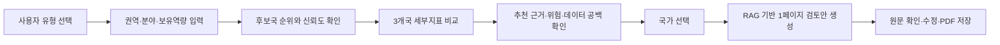
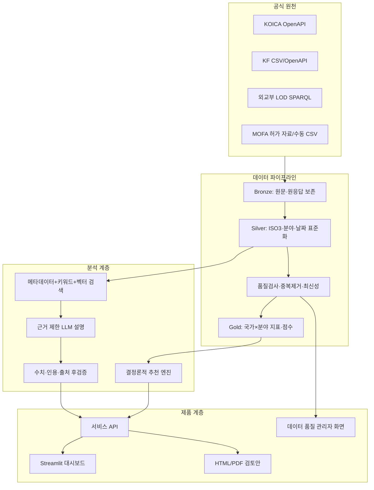

# K-Global Opportunity Radar 개발 로드맵

기준일: 2026-07-17
현재 버전: `mvp-1.0`
목표: 외교 공공데이터를 실제로 수집·정제하고, 국가·분야별 우선 검토 후보와 근거·위험·추가 조사사항을 제공하는 발표 가능한 제품 완성

## 1. 로드맵 운영 원칙

기능 수는 최대화하되 다음 순서로 개발한다.

1. 실제 데이터와 출처가 연결된 핵심 사용자 흐름을 먼저 완성한다.
2. 추천 점수는 결정론적 알고리즘이 계산하고 LLM은 근거 검색·분류·설명만 담당한다.
3. 새로운 기능은 핵심 데모를 깨뜨리지 않는 독립 모듈로 추가한다.
4. 모든 점수·설명은 데이터 기준일, 산식 버전, 원문 근거로 역추적할 수 있어야 한다.
5. 발표 직전에는 기능 추가보다 데이터 오류·응답 실패·데모 복구 능력을 우선한다.

## 2. 현재 기준선

### 구현 완료

- Python 패키지와 CLI
- SQLite 기반 국가·분야·원천자료·사업·근거·점수 스키마
- 교육·디지털교육, 직업훈련, 보건, 농업·기후·환경, 한국학·문화 5개 분야
- 수요·외교 정합성·수행 기반·한국학/문화 기반의 분야별 가중합
- 시간감쇠, 데이터 신뢰도, 안전 주의지표, 가중치 민감도
- KOICA XML API 클라이언트 골격과 KF 한국학 CSV 적재기
- 근거 ID를 제한하는 템플릿/LLM 설명 인터페이스
- 베트남·인도네시아·몽골 합성 데이터 데모
- 엔드투엔드·재현성·근거 무결성 자동 테스트

### 핵심 미완료

- 실제 KOICA 응답 필드 매핑과 전체 페이지 수집
- KF 한류·공공외교 실데이터 적재
- 외교부 LOD SPARQL 수집기
- MOFA 인사이트의 합법적·안정적 입력 방식 확정
- 10개국 이상 기준 모집단
- 문서 청킹·임베딩·하이브리드 검색
- 사용자용 웹 UI
- 실제 LLM 호출과 인용 후검증
- 보고서 출력, 사용자 테스트, 발표용 장애 대응

## 3. 목표 사용자 흐름



발표 심사 전까지 A~H가 한 번도 끊기지 않고 연결되는 것이 P0 완료 조건이다.

## 4. 목표 시스템 구조



## 5. 우선순위 정의

| 등급 | 의미 | 원칙 |
|---|---|---|
| P0 | 발표에 반드시 필요한 핵심 기능 | 실패하면 다른 기능을 중단하고 복구 |
| P1 | 차별성과 완성도를 크게 높이는 기능 | P0 흐름이 안정된 뒤 병렬 개발 |
| P2 | 시간이 남으면 넣을 확장 기능 | 독립 기능으로만 추가 |
| P3 | 대회 이후 사업화 기능 | 발표에서는 로드맵으로 제시 |

## 6. 일정 개요

발표일이 확정되지 않았으므로 `2026-07-17 ~ 2026-08-10`을 최대 개발창으로 가정한다. P0는 7월 28일까지 완성해 조기 발표에도 대응한다.

| 스프린트 | 기간 | 핵심 결과 |
|---|---|---|
| Sprint 0 | 7/17~7/18 | 기준선 고정, 설정·로그·데이터 계약 확정 |
| Sprint 1 | 7/19~7/23 | KOICA/KF 실제 데이터와 10개국 이상 적재 |
| Sprint 2 | 7/24~7/28 | 추천 엔진 v2와 기본 Streamlit 데모 완성 |
| Sprint 3 | 7/29~8/2 | LOD/MOFA 근거, RAG, LLM 검토안 연결 |
| Sprint 4 | 8/3~8/7 | 비교·보고서·관리화면·사용자 테스트 |
| Buffer | 8/8~8/10 | 버그 수정, 오프라인 데모, 발표 리허설 |

## 7. Sprint 0 - 안정적인 개발 기반

### P0 작업

- `.env.example`과 설정 로더 추가
- API 키·DB 경로·모델명·기준일을 코드에서 분리
- DB 스키마 버전과 마이그레이션 체계 추가
- 구조화 로그와 수집 실행 ID 추가
- 실패한 수집을 재실행할 수 있는 체크포인트 추가
- 합성 데이터와 실제 데이터가 섞이지 않도록 `data_mode` 저장
- 현재 테스트를 CI에서 실행할 수 있도록 명령 통일

### 완료 기준

- 새 PC에서 README만 보고 10분 안에 데모 실행
- 동일 데이터를 두 번 적재해도 중복 행이 생기지 않음
- API 키가 없어도 합성 데모가 정상 작동
- 실제/합성 데이터 여부가 화면과 보고서에 표시

## 8. Sprint 1 - 실제 데이터 파이프라인

### 8.1 KOICA 수집기 P0

- 공공데이터포털 서비스키 연동
- 국가·분야별 사업목록 전체 페이지 순회
- 사업상세 API로 예산, 사업기간, 유형, 상태, 시행기관 보강
- XML 필드명 변경·빈 응답·API 오류 처리
- 원응답을 날짜별 JSON/XML로 보존
- 국가명과 국가코드를 ISO3로 통일
- KOICA 분야코드를 내부 5개 분야로 매핑
- 사업명 키워드 분류 결과와 원래 분야코드를 함께 보존

완료 기준:

- 베트남·인도네시아·몽골의 실제 프로젝트가 DB에 적재됨
- 최소 10개 비교국을 정규화 기준 모집단으로 적재
- 사업 수, 예산 합계, 연도별 건수가 원천과 표본 대조됨
- 재실행 시 중복 프로젝트 0건

### 8.2 KF 데이터 P0/P1

- 해외대학 한국학 과정 운영현황 CSV 적재
- 한류 동호회·회원 수 원자료 적재
- KF 공공외교 사업 API/CSV 적재
- 학사·석사·박사·비학위·연구센터 등 불리언 정규화
- 국가별 마지막 기준일과 데이터 한계 저장

완료 기준:

- 3개 시범국의 한국학 과정 수를 원본과 대조
- 한류 최신연도와 전년 대비 변화율 계산
- 오래된 한국학 자료에는 최신성 경고가 자동 표시

### 8.3 외교부 LOD P1

- SPARQL 쿼리 템플릿 관리
- 국가 관련 외교일지·보도자료·브리핑·발간자료 수집
- URI, 문서유형, 국가, 기관, 사건, 날짜 보존
- 국가별 증분 수집과 마지막 성공시점 저장
- 동일 문서의 LOD/MOFA 중복 식별

### 8.4 MOFA 인사이트 P1

- 공개 API 또는 제공 파일 존재 여부 확인
- 공식 방식이 없으면 관리자용 CSV 업로드로 제한
- 공관 활동과 해외안전정보를 별도 데이터 계약으로 관리
- 여행경보 단계와 단순 안전공지 빈도를 구분
- 전체 국가 위험과 일부 지역 위험을 구분

### 8.5 데이터 품질 기능 P0

- ISO2/ISO3/한글/영문 국가 별칭 사전
- 분야 분류 미확정 큐
- 날짜·예산·국가·사업 ID 유효성 검사
- 중복 문서 유사도 검사
- 데이터 충족률과 최신성 자동 산출
- 소스별 마지막 성공·실패·레코드 수 대시보드

## 9. Sprint 2 - 추천 엔진 v2와 기본 UI

### 9.1 점수 엔진 v2 P0

현재 산식을 다음 구조로 확장한다.

```text
기회점수 = 분야별 가중치 × [관측수요, 외교정합성, 수행기반, 한국·문화기반]
별도지표 = [데이터신뢰도, 안전위험, 사업포화도, 순위안정성]
```

작업:

- 10개국 이상 기준 모집단으로 정규화
- 권역 전체와 전 세계 기준 백분위를 모두 저장
- 예산·건수 로그변환과 이상치 절단
- 최근 3년/5년/10년 창을 선택 가능하게 구성
- 데이터 부족을 0점과 구분
- 데이터 신뢰도 60 미만은 순위에서 제외
- 분야별 가중치 버전 관리
- 사용자 유형별 가중치 프리셋 제공
- 가중치 ±20% 시 점수·순위 변동 계산
- 기존 사업 집중도를 `포화도/수행경험` 두 관점으로 동시 제공

### 9.2 사용자 프리셋 P1

| 프리셋 | 강조 지표 |
|---|---|
| 대학·프로젝트팀 | 자료 충족률, 한국학 기반, 실행 난이도 |
| 기업 ESG | 현지 수요, 기존 수행기관, 위험 |
| 공공기관 | 외교 정합성, 기존 사업, 데이터 신뢰도 |
| 국제교류 | 한국학·한류·공공외교 활동 |

### 9.3 Streamlit 기본 UI P0

- 시작 화면과 서비스 한계 고지
- 사용자 유형·국가·권역·분야·보유역량 입력
- 후보국 카드: 점수, 신뢰도, 위험, 최신성
- 세부지표 막대/레이더 차트
- 3개국 비교표
- 점수 산식과 데이터 기준일 펼쳐보기
- 국가별 상위 긍정·주의 근거 카드
- 원문 링크 이동
- 데이터가 부족한 분야의 비활성화 및 안내

### 완료 기준

- 사용자가 3번 이내 클릭으로 후보국 목록 확인
- 모든 숫자에 산식·기준일·출처가 연결됨
- 데이터 부족과 낮은 점수가 시각적으로 구분됨
- 합성 데이터 사용 시 화면 상단에 명확한 배지 표시

## 10. Sprint 3 - RAG와 LLM 설명

### 10.1 문서 구조화 P0/P1

- 문서를 국가·분야·날짜·기관·이벤트 유형으로 분류
- LLM 출력은 JSON Schema로 제한
- 원문 근거문장과 문자 위치 저장
- 분류 확신도 0.8 미만은 검수 큐로 이동
- 협정/MOU, 공동사업, 고위급 면담, 공관행사, 단순언급 구분
- 규칙 기반 분류와 LLM 분류 결과를 함께 보존

### 10.2 검색 계층 P0

- 국가·분야·기간 메타데이터 필터
- SQLite FTS5 키워드 검색
- 임베딩 기반 벡터 검색
- 키워드+벡터 점수 결합
- 기관별 최대 근거 수 제한으로 특정 출처 편중 방지
- 동일 문서·유사 문서 중복 제거
- 최신성과 공식성 기반 재정렬

MVP 저장소 선택:

- 데이터가 적으면 SQLite FTS5 + 로컬 벡터 인덱스
- 동시 사용자와 국가 수가 늘면 PostgreSQL + pgvector로 전환

### 10.3 LLM 설명 P0

출력 항목:

- 추천 요약
- 주요 강점 3개
- 위험·주의사항
- 데이터 공백
- 기존 유사사업 및 포화 가능성
- 다음 조사 질문
- 활용한 evidence ID

제약:

- LLM은 점수를 계산하거나 변경하지 않음
- DB에 없는 숫자 생성 금지
- 검색된 evidence에 없는 기관·사업·협정 생성 금지
- 근거가 부족하면 `추가 확인 필요`로 출력
- 모든 문장은 하나 이상의 evidence ID 또는 `분석 해석` 라벨 필요

### 10.4 인용 후검증 P0

- 반환된 evidence ID가 조회 후보에 포함됐는지 확인
- 숫자 문자열이 DB 값과 일치하는지 확인
- 기관·사업명이 근거 문서에 존재하는지 확인
- 지원되지 않는 문장을 삭제하거나 경고 처리
- LLM 실패 시 템플릿 설명으로 자동 전환
- 동일 입력 결과를 캐시해 비용과 변동성 감소

### 10.5 1페이지 검토안 P1

- 현지에서 관측되는 수요
- 한국 측 활용 가능 기반
- 가능한 협력기관의 `유형`
- 기존 유사사업
- 위험과 데이터 공백
- 추진 전 확인사항
- 출처 목록
- 사업 확정안이 아니라 초기 조사 초안이라는 고지

## 11. Sprint 4 - 고급 기능과 제품 완성

### P1 기능

- 국가 비교 즐겨찾기
- 사용자 가중치 슬라이더
- 가중치 변경 전후 순위 비교
- 국가별 연도 추세 차트
- 데이터 출처별 근거 필터
- 사업 포화도와 신규 조사 필요도 2×2 매트릭스
- HTML/PDF 보고서 저장
- CSV 데이터 내보내기
- 분석 세션 저장·불러오기
- 사용자 피드백: 추천 유용/무용, 수정 항목, 최종 선택국
- 관리자 데이터 검수 화면
- 분야 분류 수정 및 재점수 버튼
- 데이터 갱신 상태와 오류 알림

### P2 기능

- 세계지도 기반 국가 탐색
- 국가-기관-사업 지식그래프 시각화
- 시나리오 비교: 보수적/균형/기회중심
- 다국어 한국어/영어 보고서
- 분야 하위주제 자유 입력과 내부 분야 매핑
- 사용자 보유역량과 현지 수요의 매칭 점수
- 유사 KOICA/KF 사업 추천
- 잠재 협력기관 유형 추천
- 국가별 추가 조사 체크리스트 자동 생성
- 보고서 편집기와 사용자 수정 이력
- 데이터 변경 전후 점수 변화 알림
- 근거 문서 요약과 원문 문단 하이라이트
- 접근성·모바일 화면 대응

### P3 사업화 기능

- 계정·조직·권한
- 기관별 비공개 평가기준
- 분석 프로젝트 협업·댓글
- 정기 보고서 예약 생성
- 국가·분야 모니터링 알림
- API 상품화
- 기관별 데이터 커넥터
- 감사 로그와 모델 사용량·비용 관리
- PostgreSQL/pgvector 전환
- 작업 큐와 비동기 보고서 생성
- 운영 모니터링·백업·재해복구

## 12. 기능 백로그

| ID | 기능 | 우선순위 | 담당 | 선행 작업 | 예상 |
|---|---|---:|---|---|---:|
| DAT-01 | KOICA 실제 XML 필드 매핑 | P0 | 데이터 | 서비스키·응답 샘플 | 0.5일 |
| DAT-02 | KOICA 페이지네이션·재시도 | P0 | 데이터/백엔드 | DAT-01 | 0.5일 |
| DAT-03 | KF 한국학 CSV 적재 | P0 | 데이터 | 원본 파일 | 0.5일 |
| DAT-04 | KF 한류 원자료 적재 | P0 | 데이터 | 원본 파일 | 0.5일 |
| DAT-05 | KF 공공외교 사업 적재 | P1 | 데이터 | API 승인 | 1일 |
| DAT-06 | ISO 국가 별칭 사전 | P0 | 데이터 | 없음 | 0.5일 |
| DAT-07 | KOICA→내부 분야 매핑표 | P0 | 데이터/PM | 실제 코드 | 1일 |
| DAT-08 | LOD SPARQL 수집기 | P1 | 데이터/백엔드 | 쿼리 검증 | 1.5일 |
| DAT-09 | MOFA CSV 관리자 입력 | P1 | 백엔드 | 데이터 방식 결정 | 0.5일 |
| DAT-10 | 원천 응답 보존·수집 이력 | P0 | 백엔드 | 설정 체계 | 0.5일 |
| ALG-01 | 10개국 기준 정규화 | P0 | 데이터 | DAT-01 | 0.5일 |
| ALG-02 | 분야 활성화 조건 | P0 | 데이터 | DAT-07 | 0.5일 |
| ALG-03 | 결측/신뢰도 v2 | P0 | 데이터 | DAT-10 | 0.5일 |
| ALG-04 | 순위 민감도 | P1 | 데이터 | ALG-01 | 0.5일 |
| ALG-05 | 사업 포화도 | P1 | 데이터 | DAT-01 | 0.5일 |
| ALG-06 | 사용자 프리셋 | P1 | PM/데이터 | 가중치 검토 | 0.5일 |
| RAG-01 | 문서 청킹·메타데이터 | P0 | 백엔드 | DAT-08/09 | 1일 |
| RAG-02 | FTS5 검색 | P0 | 백엔드 | RAG-01 | 0.5일 |
| RAG-03 | 벡터 검색 | P1 | 백엔드 | RAG-01 | 1일 |
| RAG-04 | 하이브리드 재정렬 | P1 | 백엔드/데이터 | RAG-02/03 | 0.5일 |
| LLM-01 | JSON Schema 추출 | P0 | 백엔드 | 모델키 | 1일 |
| LLM-02 | 설명 프롬프트·후검증 | P0 | 백엔드/데이터 | RAG-02 | 1일 |
| LLM-03 | 검토안 생성 | P1 | 백엔드/PM | LLM-02 | 1일 |
| LLM-04 | 템플릿 폴백·캐시 | P0 | 백엔드 | LLM-02 | 0.5일 |
| UI-01 | 조건 입력 화면 | P0 | 프론트 | API 계약 | 0.5일 |
| UI-02 | 후보국 순위 카드 | P0 | 프론트 | ALG-01 | 0.5일 |
| UI-03 | 국가 비교 화면 | P0 | 프론트 | UI-02 | 1일 |
| UI-04 | 근거·위험 카드 | P0 | 프론트 | LLM-02 | 1일 |
| UI-05 | 검토안 화면 | P1 | 프론트 | LLM-03 | 0.5일 |
| UI-06 | PDF/HTML 저장 | P1 | 프론트/백엔드 | UI-05 | 1일 |
| UI-07 | 관리자 품질 화면 | P1 | 프론트/데이터 | DAT-10 | 1일 |
| QA-01 | 실제 데이터 표본 대조 | P0 | 데이터/PM | Sprint 1 | 1일 |
| QA-02 | 인용 정확성 테스트셋 | P0 | PM/데이터 | LLM-02 | 1일 |
| QA-03 | 사용자 시나리오 20개 | P0 | PM | 기본 UI | 0.5일 |
| QA-04 | 오프라인 데모 번들 | P0 | 전원 | 전체 P0 | 0.5일 |
| QA-05 | 발표 리허설·복구 훈련 | P0 | 전원 | QA-04 | 1일 |

## 13. 역할별 권장 배분

### 데이터·알고리즘

- 국가·분야 표준화 사전
- 실제 데이터 적재와 검증
- 지표 정의서 및 산식 버전 관리
- 정규화 기준 모집단
- 결측·최신성·신뢰도
- 가중치·순위 민감도
- 분야 분류 정확도 평가
- 추천 결과 표본 검수

### 백엔드·API

- 수집 실행기와 재시도
- DB 마이그레이션
- LOD/KF/KOICA 어댑터
- 검색·RAG·LLM 연결
- 인용 후검증·캐시
- 서비스 API와 보고서 생성

### 프론트엔드·데모

- 입력·추천·비교·근거·검토안 화면
- 그래프와 출처 표시
- 데이터 부족·위험 UX
- 관리자 품질 화면
- 배포와 오프라인 데모

### PM·기획·발표

- 지원 사용자와 사용 시나리오 확정
- 지표 의미·서비스 한계 문구
- 테스트 질문과 기대 결과
- 사용자 테스트
- 발표 스토리·영상·백업자료
- 기능 범위 동결 결정

## 14. 품질 기준

### 데이터

- 국가 코드 매핑 정확도: 99% 이상
- 필수 필드 파싱 성공률: 98% 이상
- 중복 프로젝트/문서: 1% 미만
- 분야 분류 정확도: 90% 이상
- 원천 대비 예산·건수 표본 오차: 0

### 추천

- 동일 입력의 동일 점수 재현율: 100%
- 가중치 ±20%에서 상위 3개국 안정성 표시: 100%
- 데이터 신뢰도 60 미만 결과의 강한 추천: 0건
- 결측값을 0점으로 오해하는 화면: 0건

### LLM/RAG

- 인용 ID 유효성: 100%
- 숫자 근거 일치율: 100%
- 핵심 주장 근거 포함률: 95% 이상
- 근거 없는 기관·사업명 생성: 0건
- LLM 실패 시 템플릿 전환: 100%

### 제품

- 핵심 흐름 성공률: 95% 이상
- 일반 추천 응답: 3초 이내
- LLM 검토안: 20초 이내 또는 진행 상태 표시
- 발표용 10회 연속 데모 성공
- 네트워크 차단 시 오프라인 데모 가능

## 15. 테스트 시나리오

최소 다음 유형을 각각 3~5개 만든다.

1. 정상 데이터가 충분한 국가·분야
2. KOICA는 많지만 외교 근거가 적은 경우
3. 외교 활동은 많지만 실제 사업 데이터가 적은 경우
4. 한국학·한류 기반만 강한 경우
5. 위험도가 높은 국가
6. 데이터가 오래되거나 누락된 국가
7. 가중치 변경 시 순위가 뒤집히는 경우
8. 지원하지 않는 산업 자유질문
9. 근거에 없는 기관·통계를 요구하는 질문
10. API·LLM 실패 상황

## 16. 주요 위험과 대응

| 위험 | 영향 | 대응 |
|---|---|---|
| API 키 발급 지연 | 실데이터 연결 실패 | 공식 파일 다운로드와 저장 응답 샘플 병행 |
| MOFA 자동수집 불확실 | 최신 활동 데이터 부족 | 수동 CSV·공식 링크·마지막 확인일 표시 |
| 3개국만으로 정규화 | 점수 과장 | 10개국 이상을 계산 모집단으로 적재 |
| 사업 수가 수요로 오해됨 | 추천 의미 왜곡 | `관측된 지원 집중도` 명칭과 포화도 분리 |
| LLM 환각 | 신뢰도 하락 | 근거 제한·JSON Schema·후검증·템플릿 폴백 |
| 기능 과다로 핵심 흐름 미완성 | 발표 실패 | P0 동결일 운영, P1/P2 기능 플래그 처리 |
| 인터넷/서버 장애 | 데모 중단 | 로컬 DB·캐시·오프라인 영상·스크린샷 준비 |
| 한 명에게 데이터 작업 집중 | 일정 지연 | 데이터 계약을 먼저 고정하고 적재/검수를 분담 |

## 17. 기능 동결 규칙

- 7월 28일: P0 기능 동결, 이후 P0에는 버그 수정만 허용
- 8월 2일: P1 기능 동결
- 발표 3일 전: 데이터·모델·가중치 동결
- 발표 2일 전: 네트워크 없는 오프라인 데모 생성
- 발표 1일 전: 코드 수정 금지, 발표와 복구 리허설만 수행

P1 기능이 P0 흐름을 불안정하게 만들면 기능 플래그로 끄고 발표 후 다시 활성화한다.

## 18. 발표에서 보여줄 핵심 장면

1. 사용자: `초기 스타트업 / 동남아 / 디지털교육 / AI 교사연수` 입력
2. 인도네시아·베트남·몽골의 순위와 신뢰도 비교
3. 단일 종합점수가 아니라 수요·외교·수행·한국 기반 분해
4. 안전위험과 데이터 공백을 별도 표시
5. 추천에 사용된 KOICA 사업과 외교 원문 확인
6. 가중치를 조정했을 때 순위 안정성 확인
7. 선택 국가의 1페이지 초기 검토안 생성
8. 모든 주장에 출처가 연결되고 모르는 내용은 `추가 확인 필요`로 표시

이 흐름에 직접 기여하지 않는 기능은 P2 또는 대회 이후로 미룬다.

## 19. 다음 48시간 실행 순서

1. KOICA 서비스키와 실제 XML 응답 1건 확보
2. KF 한국학·한류 원본 파일 확보
3. 국가 10개와 내부 5개 분야 매핑표 확정
4. 실제 데이터와 합성 데이터를 분리하는 설정 추가
5. KOICA 전체 페이지 수집과 원응답 저장 구현
6. 실제 적재 결과를 원천 화면과 10건 표본 대조
7. Streamlit 입력·추천 카드 화면 착수
8. P0 작업을 역할별로 나눠 매일 통합 실행

## 20. 최종 성공 조건

제품은 기능 개수가 아니라 다음 질문에 모두 `예`라고 답할 때 완성된 것으로 본다.

- 실제 외교 공공데이터가 사용됐는가?
- 같은 입력에 같은 추천 점수가 나오는가?
- 추천 이유를 세부지표와 원문으로 설명할 수 있는가?
- 데이터 부족과 위험을 숨기지 않는가?
- LLM이 없는 사실을 생성하지 못하도록 통제했는가?
- 사용자가 5분 안에 후보국 비교와 초기 검토안을 완료할 수 있는가?
- 네트워크가 없어도 발표 데모를 끝까지 진행할 수 있는가?
